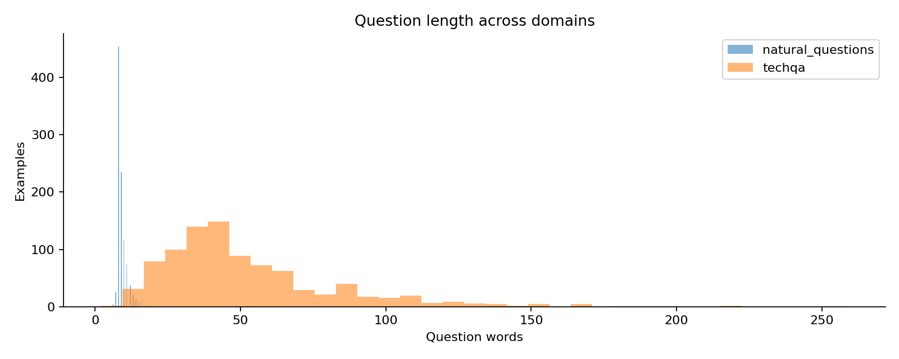
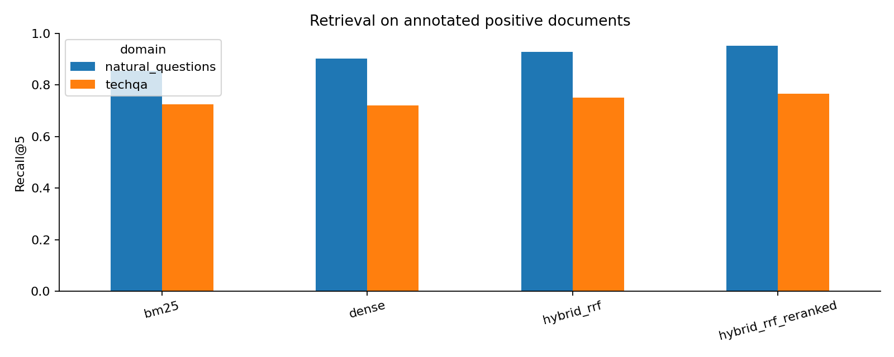
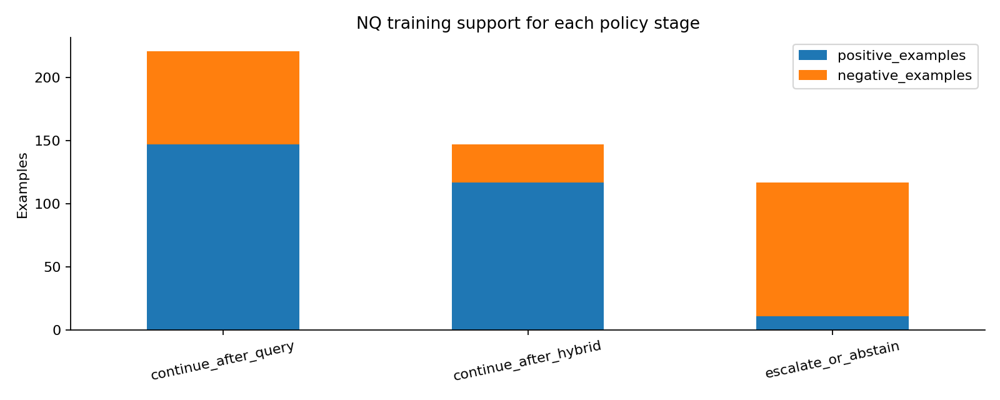
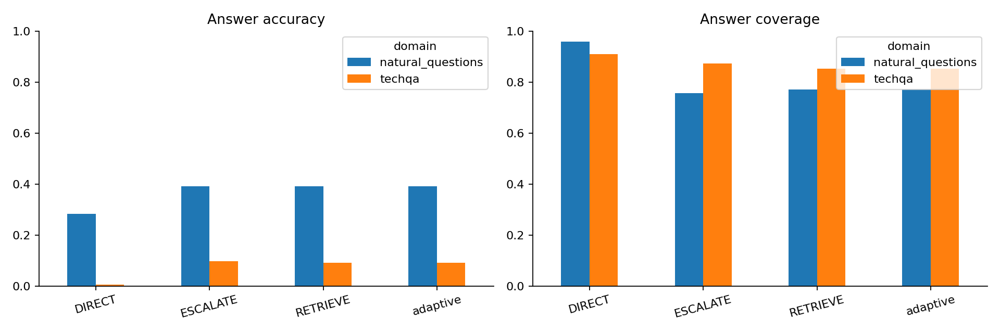

# Adaptive RAG Under Technical Domain Shift

> **Official run.** This analysis reports the GPT-5.6 Luna experiment using annotation-based Natural Questions labels, training-only text features, resumable generation, paired availability handling, cumulative retrieval latency, and validation-only policy selection.

## Executive Summary

This project tests whether a routing policy trained on Natural Questions can choose among direct generation, Hybrid RRF retrieval, reranking, and abstention after transfer to TechQA. The official run uses a closed local corpus, `gpt-5.6-luna`, and saved artifacts throughout.

The results support three conclusions:

1. **Retrieval materially improves generated answers.** On paired TechQA examples, answer accuracy rises from 0.5% with direct generation to 9.1% with Hybrid RRF and 9.6% with reranking. Task success rises from 2.9% to 14.3% with Hybrid RRF.
2. **Reranking improves retrieval ordering but adds little generation benefit.** It raises Recall@5 and MRR, but its answer-accuracy gain over Hybrid RRF is only 0.8 percentage points on Natural Questions and 0.5 points on TechQA. Hybrid RRF has slightly higher TechQA task success and utility.
3. **The learned policy does not demonstrate adaptive routing.** Validation selects thresholds that route every example to Hybrid RRF. The final “adaptive” results therefore exactly equal the static Hybrid RRF baseline.

The final status remains **research-only**. TechQA accuracy is an automatic lexical proxy, the blind human audit is incomplete, Batch does not provide synchronous end-to-end latency, and the target-domain feature shift is extreme.

## Experimental Design

The five experiment notebooks run in sequence:

1. Build annotation-based labels, construct deterministic corpora, and freeze splits.
2. Compare BM25, dense retrieval, Hybrid RRF, and cross-encoder reranking.
3. Generate direct, Hybrid RRF, and reranked answers with resumable Batch execution.
4. Train and freeze a three-stage policy using Natural Questions training and validation only.
5. Evaluate the frozen policy on untouched Natural Questions test and TechQA examples.

The notebooks and operating guide are available under [experiment_notebooks/luna_v2](experiment_notebooks/luna_v2) and [LUNA_V2_EXPERIMENT.md](LUNA_V2_EXPERIMENT.md).

## Generator Choice: Why GPT-5.6 Luna

Luna was selected to support a complete, paired experiment at scale. The design requires three generation conditions for each of 1,277 questions, producing 3,831 planned calls. Holding GPT-5.6 Luna fixed isolates the effect of retrieval and reranking under technical-domain shift. This selection is a methodological decision, rather than a claim that Luna leads a model-quality benchmark. [Official Luna model documentation](https://developers.openai.com/api/docs/models/gpt-5.6-luna).

The saved configuration, dated September 18, 2026, uses Batch rates of $0.10 per million input tokens and $0.60 per million output tokens, with a local spending safeguard for submissions. Completed responses have a combined estimated token cost of approximately $0.63; this is an artifact-derived estimate, not a provider invoice. Batch's 50% discount is appropriate for offline evaluation where immediate answers are unnecessary. Its asynchronous turnaround and unavailable synchronous generation latency make it unsuitable for measuring interactive response time. The Flask application therefore uses synchronous requests for live answers and labels optional Batch replay separately. [OpenAI Batch documentation](https://developers.openai.com/api/docs/guides/batch).

Keeping `gpt-5.6-luna`, reasoning none, the 256-token output cap, and the answer instructions fixed across all three conditions controls generator variation. The retrieved context changes, allowing a paired comparison of the tested retrieval strategies with this generator. The output cap also bounds cost, but may constrain longer technical explanations; incomplete responses remain unavailable rather than becoming incorrect-answer labels.

The tradeoff is limited generalizability. The low absolute TechQA accuracy can reflect generator capability, evidence quality, prompt/context limits, and lexical evaluation mismatch. These experiments do not isolate those causes, compare Luna directly with other generators, establish the cheapest model at a required quality level, or prove that the routing behavior transfers to another generator. A stronger-model replication and the blind human audit would be needed to support those conclusions.

## Data and Domain Shift

Notebook 01 audits 1,910 sampled questions and fixes two 5,000-document corpora. The final generation cohort contains 1,277 examples.

| Domain or category | Examples | Experimental use |
| --- | ---: | --- |
| Natural Questions short/yes-no | 369 | Primary generation and policy outcomes |
| Natural Questions long-only | 130 | Retrieval evaluation only |
| Natural Questions no-positive annotation | 501 | Audit population; excluded from answer generation |
| TechQA answerable | 608 | Target-domain answer evaluation |
| TechQA benchmark-unanswerable | 300 | Target-domain abstention evaluation |

The 369 Natural Questions generation examples are frozen into 221 training, 74 validation, and 74 test examples. TechQA contributes 908 generation examples; 14 later leave the paired analysis because at least one generation condition is unavailable.

The domains differ in format as well as topic. Natural Questions average 9.1 question words, while TechQA averages 52.3. Reference answers average 1.85 words for Natural Questions and 31.3 for TechQA. The target domain therefore tests transfer from short factual questions to long technical incidents and explanations.

## Retrieval Results

Retrieval metrics use only questions with positive gold documents: 499 Natural Questions and 610 TechQA examples. All four methods still produce rankings for all 1,910 sampled questions.

| Domain | Method | MRR | Recall@1 | Recall@5 | Recall@10 | Mean local latency |
| --- | --- | ---: | ---: | ---: | ---: | ---: |
| NQ | BM25 | 0.716 | 0.615 | 0.854 | 0.908 | 68.0 ms |
| NQ | Dense | 0.810 | 0.733 | 0.902 | 0.944 | 12.7 ms |
| NQ | Hybrid RRF | 0.810 | 0.705 | 0.928 | 0.980 | 112.5 ms |
| NQ | Reranked | **0.838** | **0.747** | **0.952** | **0.980** | 528.5 ms |
| TechQA | BM25 | 0.629 | 0.557 | 0.725 | 0.772 | 277.2 ms |
| TechQA | Dense | 0.606 | 0.523 | 0.721 | 0.774 | **17.9 ms** |
| TechQA | Hybrid RRF | 0.641 | 0.549 | 0.751 | **0.846** | 314.8 ms |
| TechQA | Reranked | **0.654** | **0.567** | **0.766** | **0.846** | 407.2 ms |

Hybrid RRF captures most of the broad-recall benefit. Reranking improves Recall@5 by 2.4 percentage points on Natural Questions and 1.5 points on TechQA, but Recall@10 is unchanged. It also adds roughly 416 ms per Natural Questions query and 92 ms per TechQA query over Hybrid RRF.

## Generation Results

Notebook 03 planned 3,831 calls across 1,277 examples and three conditions. It completed 3,813 calls (99.5%). Eighteen unavailable responses affected 14 TechQA examples; downstream comparisons remove each affected example across all conditions rather than scoring failures as wrong.

Answer accuracy measures reference correctness on answerable examples. Task success also credits an exact abstention on benchmark-unanswerable examples. Coverage is the fraction of examples on which the model issued an answer. Utility assigns `+1` to a success, `-0.25` to an issued but incorrect answer, and `0` to an abstention.

The paired cohort contains all 369 Natural Questions examples and 894 TechQA examples.

| Domain | Condition | Answer accuracy | Task success | Answer coverage |
| --- | --- | ---: | ---: | ---: |
| NQ | Direct | 32.8% | 32.8% | 96.7% |
| NQ | Hybrid RRF | 39.3% | 39.3% | 72.6% |
| NQ | Reranked | **40.1%** | **40.1%** | 74.0% |
| TechQA | Direct | 0.5% | 2.9% | 91.1% |
| TechQA | Hybrid RRF | 9.1% | **14.3%** | 85.2% |
| TechQA | Reranked | **9.6%** | 14.1% | 87.4% |

Retrieval increases automatic answer accuracy by 6.5 percentage points on Natural Questions and 8.6 points on TechQA. Reranking adds only 0.8 and 0.5 points. On TechQA, Hybrid RRF has slightly higher task success and utility than reranking because it handles the answer/abstention tradeoff more effectively.

RAG also reduces answer coverage, especially on Natural Questions. The quality improvement therefore comes partly with more model abstention and should not be described as a free accuracy gain.

Successful generation calls have an estimated total Batch cost of USD 0.631. The conservative all-attempt reservation was USD 3.342. These are estimates, not provider billing records.

## Policy Training and Validation

Notebook 04 trains on 221 Natural Questions examples and selects models and thresholds on 74 validation examples.

| Stage | Training support | Selected model | Validation Brier score |
| --- | --- | --- | ---: |
| Continue after query | 147 positive / 74 negative | Constant probability | 0.228 |
| Continue after Hybrid RRF | 117 positive / 30 negative | Constant probability | 0.190 |
| Escalate or abstain | 11 positive / 106 negative | Shallow tree | 0.0216 |

The first two stages select constant predictors because the query and retrieval features do not beat the corresponding base rates on validation. The final stage selects a tree, but escalation support is sparse.

The chosen thresholds are `[0.00, 1.01, 0.00]`. They route all 74 validation examples to Hybrid RRF, making the final policy static in practice. Validation task success is 44.6%, coverage is 74.3%, selective answer accuracy is 60.0%, and mean utility is 0.372.

## Final Held-Out Evaluation

Notebook 05 evaluates 968 paired held-out examples: 74 Natural Questions test and 894 TechQA. Because every policy action is RETRIEVE, adaptive results exactly match Hybrid RRF.

### Natural Questions test

- Hybrid RRF/adaptive task success is 39.2%, compared with 28.4% for direct generation.
- The paired improvement over direct is 10.8 percentage points, with a 95% bootstrap interval from 0.0 to 23.0 points. The small test set leaves substantial uncertainty.
- Reranking also reaches 39.2% task success. Hybrid RRF uses 113.6 ms mean retrieval time versus 521.4 ms for reranking.
- Hybrid RRF/adaptive utility is 0.297, compared with 0.115 direct and 0.301 reranked.

### TechQA

- Hybrid RRF/adaptive task success is 14.3%, compared with 2.9% direct and 14.1% reranked.
- The paired improvement over direct is 11.4 percentage points, with a 95% interval from 9.1 to 13.9 points.
- The difference from reranking is only 0.2 points, with an interval from -1.6 to 2.0 points.
- Answer accuracy is 9.1% for Hybrid RRF, 0.5% direct, and 9.6% reranked.
- Mean utility remains negative at -0.055, so even the best selected route performs poorly in absolute terms.

## Why the Policy Does Not Transfer

The final feature audit shows severe shift from Natural Questions training to TechQA:

- Question-token length: +29.4 training standard deviations
- Question-character length: +27.8 standard deviations
- Code-symbol density: +25.3 standard deviations
- Query lexical diversity: -5.85 standard deviations

Natural Questions test shifts are far smaller, led by NQ-centroid similarity at +1.57 standard deviations. The target questions lie well outside the policy’s source feature regime, and the small source validation set favors a stable static route rather than trustworthy per-query decisions.

## Interpretation and Recommendation

The official run demonstrates the value of retrieval, but it does not demonstrate successful adaptive routing.

- Direct generation is inadequate on TechQA.
- Hybrid RRF provides most of the observed quality improvement and the best TechQA task success and utility among the tested routes.
- Reranking improves ranking metrics and raw answer accuracy slightly, but its generation benefit is small and its retrieval latency is higher.
- The “adaptive” policy is operationally identical to static Hybrid RRF, so it cannot claim route-specific savings or better decisions.

Static Hybrid RRF is therefore the strongest research baseline for this run. The frozen policy should remain an auditable negative result rather than being described as a successful adaptive controller.

### Future Research

The static Hybrid RRF baseline provides a clear starting point for studying when adaptive routing helps under technical domain shift. Follow-up work could:

1. Complete the 180-row blind human answer audit to compare expert judgments with the automatic metrics.
2. Benchmark synchronous end-to-end latency to measure the experience of interactive queries, which Batch does not capture.
3. Expand the source training and validation samples to assess how stable policy selection is with more examples.
4. If adapting thresholds or models to TechQA, use a separate technical-domain validation set and then evaluate on a new untouched target test set.
5. Develop and test routing features tailored to long technical questions against the current static baseline.

The notebooks document the official run; their full output tables belong outside Git at `data/processed/luna_v2` and `artifacts/luna_v2`. The frozen policy remains comparison-only, and static Hybrid RRF is the strongest baseline supported by the results.

## Interactive Explorer

The Flask explorer uses the official run's saved outputs. The primary workflow answers live questions using local retrieval. Optional saved replay displays saved answers, evidence, Batch cost estimates, and retrieval timings. New live queries are labeled separately and do not change the frozen evaluation. The policy remains a research comparison: routing every held-out example to RETRIEVE does not demonstrate adaptive cost savings.
